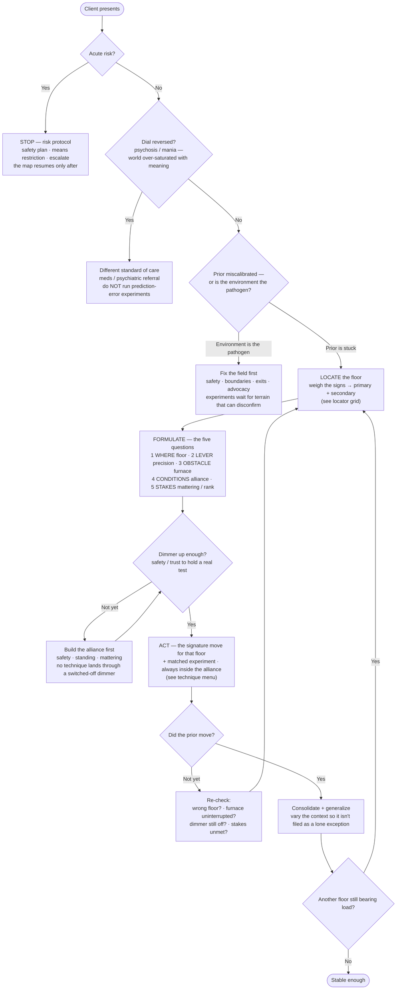

# Decision Map — Locating the Floor

*Clinician-facing. A decision **aid**, not a decision **tree**: the gates are hard stops, the floor is *weighed from signs* rather than branched to, and the whole thing **loops** — you re-locate as the case moves. Companion to [[A Unified Clinical Model of Psychotherapy]], the [[Case Formulation — One Page]], and the text version [[Decision Aid — Locating the Floor]]. Held by the therapist, not the client — the model's own logic says the person is the last one positioned to see which floor their problem lives on.*

## The map

## Locator grid — read the sign to the floor

You do not interview the client for their floor; you **read it from what shows up**. Weigh these signs; most cases yield a primary floor and a secondary.

| Sign in the room | Points to | First move |
|---|---|---|
| Accurate insight that changes nothing | *below* the floor the words are reaching | stop explaining — change channel (body / behavior / relationship) |
| Body answers first — heat, constriction, numbness, the drop | 6–7 (procedure–emotion, body) | regulate before words; somatic / interoceptive / reconsolidation family |
| Same pattern every time — across partners, jobs, decades | 4 (relational template) | work the pattern as it lives, including in the room |
| Shows up *with you* — managing, testing, compliant or opaque | 4, in the transference | name and use the enactment |
| Reaction too big for the occasion | the floor of a high-precision prior | follow the flare, not the topic |
| Verbs: "I believe," "I tell myself" | 1–3 (glass) | verbal — narrative / metacognitive / cognitive |
| Verbs: "I always end up…" | 5 (scripts) | behavioral experiment / contingency |
| Verbs: "I just shut down," "my chest closes" | 6–7 (concrete) | body and experience, not argument |
| Emotional restraint that fits the client's culture | not a floor problem — substrate (8) | assess the norm before treating it as pathology |

## Technique menu — the signature move that lands on each floor

| Floor | Reached by (families) | The signature move | Matched experiment |
|---|---|---|---|
| 1 · Narrative | narrative, logotherapy | re-author the binding story | — |
| 2 · Metacognition | MBCT, metacognitive, ACT (defusion) | change the *relation* to thought | — |
| 3 · Beliefs | CBT, REBT | marshal disconfirming evidence | behavioral / disclosure experiment |
| 4 · Relational | psychodynamic, IPT, attachment, EFT | bring the template into the room; corrective relationship | disclosure test — **ladder first** |
| 5 · Scripts | behavioral, exposure, DBT skills | new sequence; block the safety behaviors | exposure as expectancy-violation |
| 6 · Procedure–emotion | EMDR, EFT, reconsolidation | re-open the consolidated prior | — |
| 7 · Body | somatic, sensorimotor | regulate; work the felt sense | dead-air / interoceptive |
| 8 · Substrate | liberation, feminist, multicultural | name the water; check the norm | reference-class / cultural check |

**Stakes overlay (Q5), laid over any floor:** *mattering* injured → irreplaceability inventory, the unglamorous favor; *rank* injured → the reference-class swap. See [[Clinical Applications — Status, Mattering, and Rank]].

> [!warning] Read this before you use the menu
> This is where each tradition's **signature move** lands — not "the therapy for the floor." Every serious therapy reaches across several floors, and good clinicians move up and down the building within a session. The column is a starting aim, not an assignment, and it must be **normed to the client's culture** (what counts as a test, and as closeness, varies). The relationship is not one floor among these; it is the condition that turns the dimmer up so any of them can be reached.
